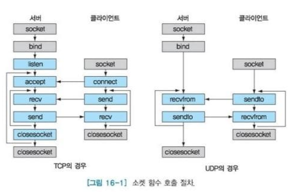
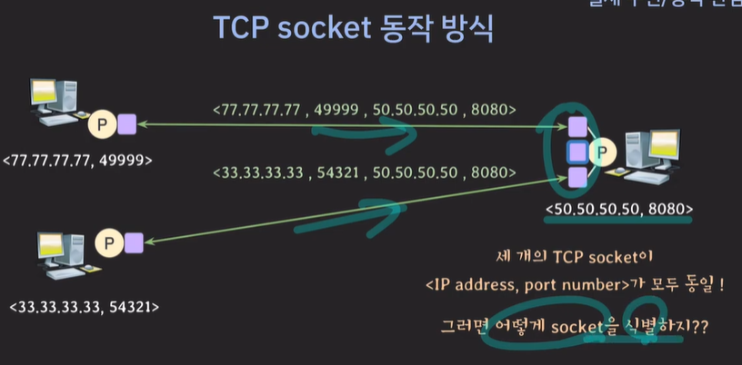

# 네트워크 프로그래밍
관련 코드 : https://github.com/Eundms/NetworkProgramming

# UDP 소켓 프로그래밍 vs TCP 소켓 프로그래밍

## TCP 소켓 프로그래밍

- connection 연결 요청 : listening socket으로
- connection 성립 이후 : src IP, src port, dest IP, dest port로 socket 식별 

## UDP 소켓 프로그래밍 
- 연결 X
- IP, Port으로 식별 

