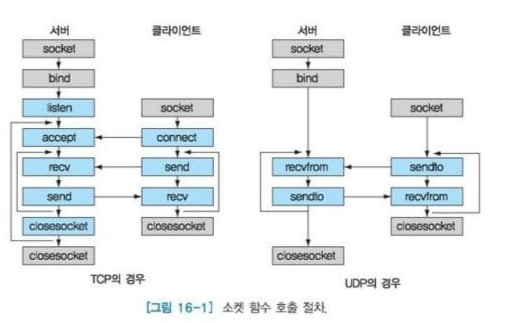
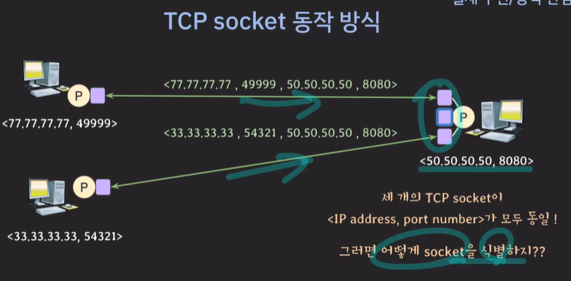

# 네트워크 프로그래밍
관련 코드 : https://github.com/Eundms/NetworkProgramming

# UDP 소켓 프로그래밍 vs TCP 소켓 프로그래밍

## TCP 소켓 프로그래밍

- connection 연결 요청 : listening socket으로
- connection 성립 이후 : src IP, src port, dest IP, dest port로 socket 식별 

### TCP: 연결 지향형 (Connection-Oriented)
연결 전에 3-way handshake 필요.  
서버는 listen() → accept() → recv()/send()의 과정을 거침.  
클라이언트는 connect()를 통해 연결 요청 후, 통신 수행.  

#### 특징
연결 상태 유지
데이터 순서 보장
신뢰성 보장
각 클라이언트마다 소켓이 생성됨

## PSH 플래그 (TCP)
PSH(Push) 플래그는 데이터를 지연 없이 바로 애플리케이션으로 전달하라는 의미.  
일반적으로 send() 함수의 데이터가 바로 전송되기를 원할 때 사용됨.  

## UDP 소켓 프로그래밍 
- 연결 X
- IP, Port으로 식별 

### UDP: 비연결 지향형 (Connectionless)
listen()/accept() 필요 없음.

서버는 recvfrom()으로 데이터 수신, 클라이언트는 sendto()로 전송.

서버는 클라이언트 연결 없이 데이터 수신 가능.

#### 특징:
연결 과정 없음
빠름 (핸드셰이크 오버헤드 없음)
데이터 순서/신뢰성 미보장
하나의 소켓으로 여러 클라이언트 처리 가능
