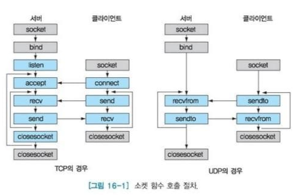

# 네트워크 애플리케이션의 원리
## 애플리케이션 구조
1. 클라이언트 서버 구조
- 서버 : 항상 켜져있는 호스트, 클라이언트 : 사용자 요청 주체

2. P2P구조
- peer : 간헐적으로 연결된 호스트쌍이 직접 통신
- `자가 확장성(self - scalability)`

## 2.1.2. 프로세스 간 통신 ~

# 웹과 HTTP
## HTTP(HyperText Transfer Protocol)
- 메시지의 구조, 클라이언트와 서버가 메시지 교환하는 방식에 대한 정의
- 서버에 `TCP 연결`을 시작, 연결이 이루어지면 브라우저와 서버 프로세스는 `소켓 인터페이스`를 통해 TCP로 접속함
- 비상태 프로토콜 : 클라이언트에 대한 정보를 유지하지 않음

## 비지속 연결과 지속 연결
- 각 요구/응답 쌍이 `분리된 TCP 연결(비지속 연결)`을 통해 보내져야 하는가, `같은 TCP 연결(지속 연결)`상으로 보내져야 하는지 결정해야 함

### 비지속 연결
> 각 TCP 연결은 하나의 요청 메시지와 하나의 응답 메시지만 전송한다

1. HTTP의 기본 포트 번호 80을 통해 www.naver.com 서버로 TCP 연결을 시도한다. 
TCP연결과 관련하여 클라이언트와 서버에 각각 소켓이 있다.
2. HTTP 클라이언트는 1단계에서 설정된 TCP연결 소켓을 통해 서버로 HTTP 요청 메시지를 보낸다.(/home.index)  
3. HTTP 서버는 1단계에서 설정된 연결 소켓을 통하여 요청 메시지를 받는다. 
저장장치로부터 /home.index 객체를 추출한다.
HTTP 응답 메시지에 객체를 캡슐화하고 응답 메시지를 소켓을 통해 클라이언트로 보낸다.
4. HTTP 서버는 TCP에게 TCP연결을 끊으라고 한다.
5. HTTP 클라이언트가 응답 메시지를 받으면 TCP연결이 중단된다.
응답 메시지로부터 HTML과 10개의 JPEG 객체에 대한 참조를 찾고 다시 1-4단계를 반복한다.

- RTT(Round-Trip Time) : 클라이언트에서 서버로 가고 다시 클라이언트로 되돌아오는 데 걸리는 시간
    - TCP 연결 설정에 `1RTT`, 객체를 요청하고 받는 데 `1RTT` 필요

### 지속 연결
-  `HTTP1.1` 지속 연결 
    - 응답을 보낸 후에 TCP 연결을 그대로 유지함
    - 연결된 요구를 수신할 때, 서버는 객체를 연속해서 보냄
    - 파이프라이닝을 활용한 지속 연결
-  `HTTP/2` 지속 연결
    - 같은 연결상태에서 다중 요청(request)와  응답(reply)이 가능
    -  HTTP 메시지 요청과 응답의 우선 순위 기법이 가능하도록  HTTP1.1 기반으로 제안됨

## HTTP 메시지 포멧
- 구조 : 요청라인(method, URL, HTTP버전) | 헤더라인(어떤 호스트에 객체가 존재하는지) | CR,LF | 개체 몸체
    - GET : URL 필드로 식별되는 객체를 요청할 때 사용
    - POST : body에 값을 넣어 사용
    - `HEAD` : GET과 거의 비슷, `HTTP 메시지로 응답`, 디버깅 용도로 사용
    - PUT : 웹서버에 객체를 업로드하기 위해 사용
    - DELETE : 웹서버에 있는 객체 지우기 위해 사용 

- `호스트 헤더라인`이 제공하는 정보는 `웹 프록시 캐시`에서 필요
    - `Connection : close` : 브라우저가 지속 연결 사용을 원치 않음을 명시
    - `User-agent` : 서버에게 요청을 하는 브라우저 타입 명시
        - 서버가 같은 객체에 대한 다른 버전을 다른 타입의 사용자 에이전트에게 보낼 수 있음  
    - `Accept-language` : 언어 버전 명시

- 상태코드 
    - 301(Moved Permanently) : 요청 객체가 영구적으로 이동, 새로운 URL은 응답 메시지의 Location 헤더에 나와 있음
    - 505(HTTP Version Not Supported) : HTTP  프로토콜 버전을 서버가 지원하지 않음

## 사용자와 서버 간의 상호작용 : 쿠키
- HTTP 상태를 유지하지 않으므로 웹 사이트가 `사용자를 확인하도록 Cookie를 사용`함
    - 비상태 위에서 사용자 세션 계층을 생성하는데 이용될 수 있음
1) HTTP 응답 메시지 쿠키 헤더 라인
2) HTTP 요청 메시지 쿠키 헤더 라인
3) 사용자의 브라우저에 사용자 종단 시스템과 관리를 지속시키는 쿠키 파일
4) 웹 사이트의 백엔드 데이터베이스

## 웹 캐싱
- Origin Web Server를 대신하여 HTTP 요구를 충족시키는 네트워크 개체
- 응답 시간과 웹 트래픽을 줄일 수 있음
- CDN(Content Distribution Network) 
    - ex) 지리적으로 가까운 클러스터  할당
- 조건부 GET 방식을 사용하여 모든 객체들이 최신의 것임을 확인하며 캐싱함

# 인터넷 전자메일
- SMTP 프로토콜
- 엘리스가  밥에게 메일을 보낸다고 하자
`엘리스 에이전트 -> 엘리스메일서버 -> 밥 메일서버 -> 밥  에이전트`

엘리스의 메일서버에서 동작하는 SMTP의 클라이언트 측은 메시지 큐에 있는 메시지를 본다.  
밥의 메일 서버에서 수행되고 있는 SMTP 서버에게 TCP 연결을 설정한다.  
초기 SMTP 핸드셰이킹 이후에 SMTP 클라이언트는 엘리스의 메시지를 TCP 연결로 보낸다.  
밥의 메일 서버 호스트에서 SMTP서버 측은 메시지를 수신한다. 밥의 메일 서버는 그 메시지를 밥의 메일 박스에   놓는다.  

- 메일서버에서 에이전트로 메시지를 가져오는 프로토콜은 POP3, IMAP, HTTP 이다 (PULL방식) 

## HTTP vs  SMTP
- HTTP : 풀 프로토콜
- SMTP : 푸시 프로토콜

# DNS - 인터넷 디렉터리 서비스
- 호스트네임 -> IP주소
- DNS는 DNS 서버들의 계층구조로 구현된 분산 데이터베이스며, 
  호스트가 분산 데이터베이스로 질의하도록 허락하는 애플리케이션 계층 프로토콜
- 로컬 DNS서버에 먼저 요청한 뒤, `루트 DNS서버`, `최상위 레벨 도메인 네임 DNS서버(TLD)`com,org..., `책임 DNS서버` 순으로 재귀적, 반복적으로 요청한다
- DNS 캐싱해둠

# 소켓프로그래밍 : 네트워크 애플리케이션 생성
## UDP 소켓 프로그래밍 vs TCP 소켓 프로그래밍
- TCP 소켓 프로그래밍
    - 서버와 클라이언트 간에 명시적으로 연결을 설정(3-way handshake)한 후 데이터를 전송
    - 연결 종료 시에도 명시적인 과정(4-way handshake)이 필요함

