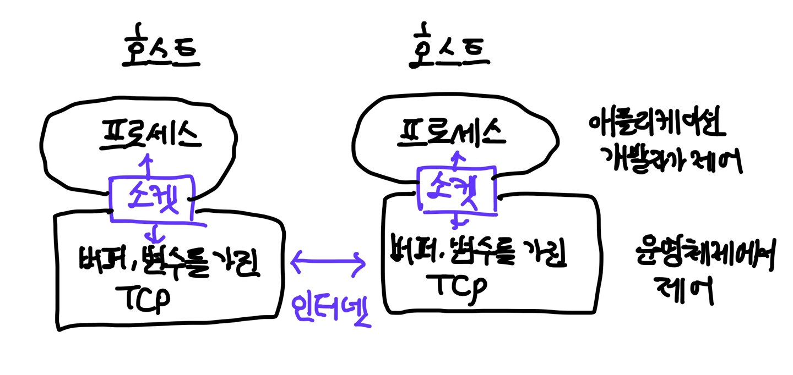

# 프로세스 간 통신
- 프로세스 간 통신을 위한 규칙은 종단 시스템의 운영체제에 의해 좌우된다  
    - TCP/IP모델에서 Application Layer 는 APPLICATION, 그 외 Layer()는 하드웨어/펌웨어, OS 레벨에서 구현/관리한다
- 다른 종단 시스템에서 두 프로세스가 통신하기 위해서는 메시지 교환 방식을 사용한다

# 소켓
> TCP/IP모델의 애플리케이션 계층과 트랜스포트 계층 간의 인터페이스
- 애플리케이션은 소켓을 통해 메시지를 받고 수신자는 네트워크 상에서 받은 메시지를 수신 프로세스의 소켓으로 이동시킨다 

- 애플리케이션 개발자는 소켓에 대한 트랜스포트 계층에 대한 통제권을 갖지 못한다 
    - 할 수 있는 것
        - 1) 트랜스포트 프로토콜의 선택
        - 2) 최대 버퍼와 최대 세그먼트 크기와 같은 약간의 트랜스포트 계층 매개변수의 설정 
- 소켓 통신에는 `IP주소`와 `Port 번호`가 사용 된다 

## 애플리케이션 계층 서비스는 `트랜스포트 계층 서비스가 제공하는 기능을 이용`한다 
### 일반적으로 제공할 수 있는 카테고리
1. 종단간 신뢰적 데이터 전송 여부 
- reliable vs unreliable (data loss, out-of-order)
2. 처리량 여부
- 대역폭 민감 애플리케이션(특정 처리율 요구사항 가짐) vs 탄력적 애플리케이션
3. 시간 보장 여부
- 지연 시간
4. 보안
- 비밀성, 데이터 무결성, 종단 인증 

### TCP와 UDP가 애플리케이션 계층 서비스에 제공하는 것 
#### TCP 
1. 연결 지향형 서비스 : 애플리케이션 계층 메시지를 전송하기 전에 TCP는 클라이언트와 서버가 서로 전송 제어 정보를 교환하도록 한다. 
    - 핸드셰이킹 과정 : 서버와 클라이언트에게 패킷이 도달할 것이니 받을 준비를 하라고 알려준다. 
    - 전이중 연결 full-duplex : TCP 연결은 두 프로세스가 서로에게 동시에 메시지를 보낼 수 있다. 
    - 연결 종료 과정 
2. 신뢰적인 데이터 전송 : 모든 데이터를 `오류 없이`, `올바른 순서`로 전달하도록 한다. 
    - 애플리케이션의 한쪽이 바이트 스트림을 소켓으로 전달하면 그 바이트 스트림을 손실하거나 중복되지 않게 수신 소켓으로 전달한다. 
+ 혼잡제어 : 네트워크 대역폭을 공평하게 공유할 수 있게 돕는다 

#### UDP
1. 비연결형 서비스 : 핸드세이킹을 하지 않음 
2. 비신뢰적인 데이터 전송 : data loss, out-of-order
+ 혼잡제어 제공하지 않으므로 송신 측은 데이터를 원하는 속도로 네트워크 계층으로 보낼 수 있음 