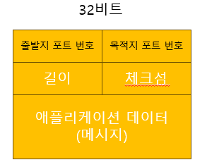

# 트랜스포트 계층(4계층) 서비스 및 개요
- 전송 계층(Transport layer)은 계층 구조의 네트워크 구성요소와 프로토콜 내에서 송신자와 수신자를 연결하는 통신 서비스를 제공
    - 서로 다른 호스트에서 동작하는 애플리케이션 프로세스들 간의 `논리적 통신(logical communication)`을 제공
        - 논리적 통신은 애플리케이션 관점에서 보면 프로세스들을 동작하는 호스트들이 직접 연결된 것처럼 보인다는 것
- 네트워크 라우터가 아닌 종단 시스템에서 구현됨
- `애플리케이션 메시지`를 `트랜스포트 계층 세그먼트`로 만들기 위해 작은 조각으로 `분할`하고 각각의 조각에 `트랜스포트 계층 헤더를 추가`하여 `네트워크 계층으로 전달`
    - 즉, `세그먼트`는 `네트워크 계층 패킷 안에 캡슐화`되어 목적지로 전달됨

## 트랜스포트 계층(4)과 네트워크 계층(3) 사이의 관계
> 네트워크 계층 프로토콜(3)은 `호스트들 사이의 논리적 통신`을   
> 트랜스포트 계층 프로토콜(4)은 `서로 다른 호스트에서 동작하는 프로세스들 사이의 논리적 통신`을 제공  
> ex) 두 집간의 논리적 통신 = 네트워크 계층 프로토콜, 전달된 편지를 통한 사람들끼리의 통신 = 트랜스포트 계층 프로토콜

- 트랜스포트 계층 프로토콜은 프로세스끼리 전송하는 메시지에 대한 `지연 보장`이나 `대역폭 보장`을 네트워크 계층 프로토콜에 `의존하여 보장`함
    - 단, 네트워크 프로토콜이 `비신뢰적(패킷 분실, 손상)`일때도 트랜스포트 계층 프로토콜은 애플리케이션에게 `신뢰적인 데이터 전송 서비스`를 `제공`할 수 있음

## 인터넷 트랜스포트 계층의 개요
- 트랜스포트 계층 프로토콜(4)
    - UDP(User Datagram Protocol) : 애플리케이션에게 비신뢰적이고 비연결형인 서비스 제공
    - TCP(Transmission Control Protocol) : 애플리케이션에게 신뢰적이고 연결지향형 서비스 제공
- 네트워크 계층 프로토콜(3)
    - IP : 호스트들 간에 논리적 통신을 제공하는 `최선형 전달 서비스(best-effort delivery service)`
        - IP가 통신하는 호스트들 간에 세그먼트를 전달하기 위해서 최대한 노력하지만... `전달`, `순서 전달`, `무결성`을 보장하지 않음
        - 따라서, `비신뢰적인 서비스(unreliable service)`라고 부름 

### 트랜스포트 계층 프로토콜 기능
1. `트랜스포트 다중화(Transport Multiplexing)`, `역다중화(Multiplexing)`
    - 종단 시스템 사이의 IP 전달 서비스를 종단 시스템에서 동작하는 두 프로세스 간의 전달 서비스로 확장하는 것   
      (호스트-대-호스트 전달 <=> 프로세스-대-프로세스 전달)
2. 헤더에 `오류 검출 필드`를 포함함으로써 무결성 검사 제공

### TCP 프로토콜
- 신뢰적인 데이터 전달(reliable data trasfer) 제공
    - 흐름제어, 순서번호, 확인응답, 타이머
- 혼잡제어(congestion control) 
    - 한 TCP 연결이 과도한 양의 트래픽으로 모든 통신하는 호스트들 사이의 스위치와 링크를 폭주되게 하는 것을 방지

# 다중화와 역다중화
- 트랜스포트 계층(4)은 네트워크 계층(3)으로부터 세그먼트를 수신하여 호스트에서 동작하는 해당 애플리케이션 프로세스에게 세그먼트의 데이터를 전달하는 의무를 가짐
- 네트워크 애플리케이션의 한 부분으로서 프로세스가 소켓을 통해 통신을 진행하게 됨
    - `역다중화(demultiplexing)` : 트랜스포트 계층(4) 세그먼트의 데이터를 올바른 소켓으로 전달하는 작업
    - `다중화(multiplexing)` : 소켓으로부터 데이터를 모으고 세그먼트를 생성하기 위해 각 데이터에 헤더 정보를 캡슐화하고 이를 네트워크 계층(3)으로 전달하는 작업
 
## `비연결형 다중화/역다중화`와 `연결형 다중화/역다중화` 서비스 구현  
- 소켓은 유일한 식별자를 가짐
- 비연결형 다중화/역다중화
    - 소스 포트 번호, 목적지 포트 번호
    - 오버헤드 적음
    - 스트리밍, DNS, VoIP
- 연결형 다중화/역다중화
    - 소스 IP, 목적지 IP, 소스 포트, 목적지 포트
    - 오버헤드 높음
    - 파일 전송, HTTP 요청, 이메일

# 비연결형 트랜스포트 : UDP
- DNS는 UDP를 사용하는 애플리케이션 계층 프로토콜의 예
    - DNS 질의 메시지를 작성하고 UDP에게 메시지를 넘겨주면 메시지에 헤더 필드를 추가한 후에 최종 세그먼트를 네트워크 계층에 넘겨주고 네트워크 계층은 UDP 세그먼트를 데이터그램으로 캡슐화하고 네임서버에 데이터그램을 송신한다. 이때, 질의 호스트에서의 DNS 애플리케이션은 질의에 대한 응답을 기다린다.
- 연결 설정, 연결 상태 X

## UDP 세그먼트 구조 
- 체크섬 : 세그먼트에 오류가 발생했는지 검사하기 위한 필드
    - 종단 간의 트랜스포트계층(4)에서 오류 검사 제공  

## UDP 체크섬 계산
- 모든 16비트 워드 단위로 더함 -> 1의 보수 수행 (윤회식 자리올림)  

# TCP : 연결지향형 
- 전이중 서비스(full-duplex) : 호스트A의 프로세스와 호스트B의 프로세스 사이에 TCP연결이 있다면 애플리케이션 계층 데이터는 B에서 A로 흐르는 동시에 A에서 B로 흐를 수 있다. TCP 연결은 단일 송신자와 단일 수신자 사이의 점대점이다. 
1. 3-way handshake 설정 
2. 송신버퍼로 데이터를 보내서 TCP 세그먼트를 만듦

## TCP 세그먼트 구조
- 출발지, 목적지 포트번호
- `순서 번호` : 전송된 바이트 스트림에 대한 순서번호; 예를 들어, 500000바이트 크기 중 MSS가 1000바이트 일 때, 0, 1000, 2000,... 5000 이 된다
- `확인응답번호` :  호스트 A가 호스트 B로부터 기대하는 다음 바이트의 순서 번호; 예를 들어 535번까지 받았다고 치면 확인응답번호에 536번을 적어 보낸다 //누적확인응답
- 헤더 길이 필드 : TCP 헤더 길이 
- 플래그 : ACK, RST, SYN, FIN, URG
    - RST 
- 수신 윈도우 필드 : 흐름제어에 사용
- 체크섬
- 옵션
- 데이터

- RTT(Round-Trip-Time;왕복시간) 예측과 타임아웃
## 1. 신뢰성 있는 데이터 전송의 원리
### 신뢰적인 데이터 전송 프로토콜 (reliable data transfer protocol) 구축
- rdt1.0: 완벽한 신뢰 채널
    - 오류가 생길 수 없으므로 수신 측이 송신 측에게 어떤 피드백(feedback)도 제공할 필요가 없음
- rdt2.0: 비트 오류가 있는 채널 상에서의 신뢰적 데이터 전송
    - `ARQ(Automatic Repeat reQuest) 프로토콜` : 컴퓨터 네트워크 설정에서 재전송을 기반으로 하는 신뢰적인 데이터 전송 프로토콜
        - 오류 검출 : 비트 오류를 수신자가 검출할 수 있어야 함
        - 수신자 피드백 : ACK, NAK과 같은 수신자 상태를 알기 위한 방법
        - 재전송 : 수신자에서 오류를 가지고 수신된 패킷은 송신자에 의해서 재전송됨
    - == `전송 후 대기(stop-and-wait) 프로토콜` : 하나의 데이터를 전송하고 피드백을 받기 전까지 다음 데이터를 보내지 않는 방식
    - 문제점 : 수신자 피드백을 나타내는 패킷도 손상될 수 있음
    - 해결방안 
        - 1) 왜곡된 ACK, NAK 패킷을 수신할 때 현재 데이터 패킷을 단순히 다시 송신 : `중복 패킷`
        - 2) `순서번호(sequence number)` 삽입 : 데이터패킷에 송신자가 번호를 붙이기
- rdt3.0: 비트 오류, 손실 있는 채널 상에서의 신뢰적 데이터 전송
    - 카운트다운 타이머(countdown timer) : 주어진 시간이 경과된 후에 송신자 중단
    - == `얼터네이팅 비트 프로토콜(alternating-bit protocol)`

### 파이프라인된 신뢰적 데이터 전송 프로토콜
- 파이프라이닝, 필요한 순서번호의 범위와 버퍼링 조건은 데이터 전송 프로토콜이 손실 패킷과 손상 패킷    그리고 상당히 지연된 패킷들에 대해 응답하는 방법에 의존함
- 파이프라인 오류 회복 2가지 기법 : `N부터 반복(Go-Back-N) - 슬라이딩 윈도우`, `선택적 반복(Selective Repeat, SR)` 

#### N부터 반복(Go-Back-N) : 슬라이딩 윈도우 프로토콜
- 확인 응답이 안 된 가장 오래된 패킷의 순서번호를 base로 정의하고 사용되지 않은 가장 작은 순서번호를 전송될 다음 패킷의 순서번호(nextseqnum)로 정의한다. 
    - 허용할 수 있는 순서번호의 범위는 순서번호의 범위 상에서 크기가 N인 윈도우로 나타난다. N을 윈도우 크기라 부른다
    - 순서가 잘못되어 확인 응답이 안 된 가장 오랜 패킷의 순서번호보다 큰 값이 오면 해당 패킷은 버린다. (왜인지는 base의 의미를 생각해보자) 따라서, 패킷 하나의 오류 때문에 많은 패킷을 재전송할 수 있다.
- 타임아웃, ACK 패킷을 이용한다 
- 전송후대기 프로토콜에서의 채널 이용률 문제를 해결한다. 

#### 선택적 반복(Selective Repeat, SR)
- 수신자에서 오류가 발생한 패킷을 수신했다고 의심되는 패킷만을 송신자가 다시 전송한다. 필요에 따라 개별적인 재전송은 개별적인 확인응답을 요구한다. 

### 세그먼트 구조에서 신뢰성 있는 데이터 전송을 담당하는 역할
- 체크섬 : 전송된 패킷 안의 비트 오류를 발견하는 데 사용한다
- 타이머 : 채널 안에서 패킷이 손실되었기 때문에 발생되는 패킷의 타임 아웃/재전송에 사용한다 
- 순서번호 : 송신자에서 수신자로 가는 데이터 패킷의 순서번호를 붙이기 위해서 사용된다
- 확인응답 : 패킷이 제대로 수신되었다는 사실을 송신자에게 알리기 위해 사용된다
- 부정 확인응답 : 정확히 수신되지 않았음을 알리기 위해 사용한다

## 2. 혼잡제어의 원리
- Slow Start : ACK을 받으면 전송속도를 지수적으로 증가시킵니다 
- Congestion Avoidance : 혼잡이 발생할 가능성을 줄이기 위해 송신 속도를 선형적으로 증가시킵니다 
- Fast Retransmit : 패킷 손실을 암시하는 중복 ACK을 감지하면 즉시 손실된 패킷을 재전송합니다 
- Fast Recovery : 혼잡 윈도우 크기를 줄이고 느린 시작 단계로 돌아가지 않고 혼잡 회피 단계를 유지합니다 