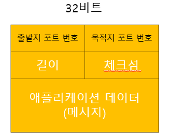

# 트랜스포트 계층(4계층) 서비스 및 개요
- 전송 계층(Transport layer)은 계층 구조의 네트워크 구성요소와 프로토콜 내에서 송신자와 수신자를 연결하는 통신 서비스를 제공
    - 서로 다른 호스트에서 동작하는 애플리케이션 프로세스들 간의 `논리적 통신(logical communication)`을 제공
        - 논리적 통신은 애플리케이션 관점에서 보면 프로세스들을 동작하는 호스트들이 직접 연결된 것처럼 보인다는 것
- 네트워크 라우터가 아닌 종단 시스템에서 구현됨
- `애플리케이션 메시지`를 `트랜스포트 계층 세그먼트`로 만들기 위해 작은 조각으로 `분할`하고 각각의 조각에 `트랜스포트 계층 헤더를 추가`하여 `네트워크 계층으로 전달`
    - 즉, `세그먼트`는 `네트워크 계층 패킷 안에 캡슐화`되어 목적지로 전달됨

## 트랜스포트 계층(4)과 네트워크 계층(3) 사이의 관계
> 네트워크 계층 프로토콜(3)은 `호스트들 사이의 논리적 통신`을   
> 트랜스포트 계층 프로토콜(4)은 `서로 다른 호스트에서 동작하는 프로세스들 사이의 논리적 통신`을 제공  
> ex) 두 집간의 논리적 통신 = 네트워크 계층 프로토콜, 전달된 편지를 통한 사람들끼리의 통신 = 트랜스포트 계층 프로토콜

- 트랜스포트 계층 프로토콜은 프로세스끼리 전송하는 메시지에 대한 `지연 보장`이나 `대역폭 보장`을 네트워크 계층 프로토콜에 `의존하여 보장`함
    - 단, 네트워크 프로토콜이 `비신뢰적(패킷 분실, 손상)`일때도 트랜스포트 계층 프로토콜은 애플리케이션에게 `신뢰적인 데이터 전송 서비스`를 `제공`할 수 있음

## 인터넷 트랜스포트 계층의 개요
- 트랜스포트 계층 프로토콜(4)
    - UDP(User Datagram Protocol) : 애플리케이션에게 비신뢰적이고 비연결형인 서비스 제공
    - TCP(Transmission Control Protocol) : 애플리케이션에게 신뢰적이고 연결지향형 서비스 제공
- 네트워크 계층 프로토콜(3)
    - IP : 호스트들 간에 논리적 통신을 제공하는 `최선형 전달 서비스(best-effort delivery service)`
        - IP가 통신하는 호스트들 간에 세그먼트를 전달하기 위해서 최대한 노력하지만... `전달`, `순서 전달`, `무결성`을 보장하지 않음
        - 따라서, `비신뢰적인 서비스(unreliable service)`라고 부름 

### 트랜스포트 계층 프로토콜 기능
1. `트랜스포트 다중화(Transport Multiplexing)`, `역다중화(Multiplexing)`
    - 종단 시스템 사이의 IP 전달 서비스를 종단 시스템에서 동작하는 두 프로세스 간의 전달 서비스로 확장하는 것   
      (호스트-대-호스트 전달 <=> 프로세스-대-프로세스 전달)
2. 헤더에 `오류 검출 필드`를 포함함으로써 무결성 검사 제공

### 1. TCP 프로토콜
- `신뢰적인 데이터 전달(reliable data trasfer)` 제공
    - 흐름제어, 순서번호, 확인응답, 타이머
- `혼잡제어(congestion control)` 
    - 한 TCP 연결이 과도한 양의 트래픽으로 모든 통신하는 호스트들 사이의 스위치와 링크를 폭주되게 하는 것을 방지

#### TCP 세그먼트 구조
- 출발지, 목적지 포트번호
- `순서 번호` : 전송된 바이트 스트림에 대한 순서번호; 예를 들어, 500000바이트 크기 중 MSS가 1000바이트 일 때, 0, 1000, 2000,... 5000 이 된다
- `확인응답번호` :  호스트 A가 호스트 B로부터 기대하는 다음 바이트의 순서 번호; 예를 들어 535번까지 받았다고 치면 확인응답번호에 536번을 적어 보낸다 //누적확인응답
- 헤더 길이 필드 : TCP 헤더 길이 
- 플래그 : ACK, RST, SYN, FIN, URG
    - RST 
- 수신 윈도우 필드 : 흐름제어에 사용
- 체크섬
- 옵션
- 데이터

### 2. UDP 프로토콜
- 연결 설정, 연결 상태 X
- DNS는 UDP를 사용하는 애플리케이션 계층 프로토콜의 예
    - DNS 질의 메시지를 작성하고 UDP에게 메시지를 넘겨주면 메시지에 헤더 필드를 추가한 후에 최종 세그먼트를 네트워크 계층에 넘겨주고 네트워크 계층은 UDP 세그먼트를 데이터그램으로 캡슐화하고 네임서버에 데이터그램을 송신한다. 이때, 질의 호스트에서의 DNS 애플리케이션은 질의에 대한 응답을 기다린다.

#### UDP 세그먼트 구조 
- 체크섬 : 세그먼트에 오류가 발생했는지 검사하기 위한 필드
    - 종단 간의 트랜스포트계층(4)에서 오류 검사 제공  

#### UDP 체크섬 계산
- 모든 16비트 워드 단위로 더함 -> 1의 보수 수행 (윤회식 자리올림)  

