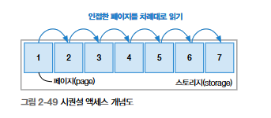
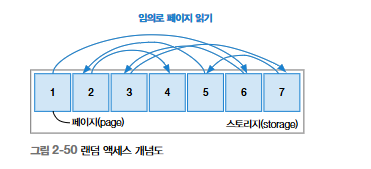
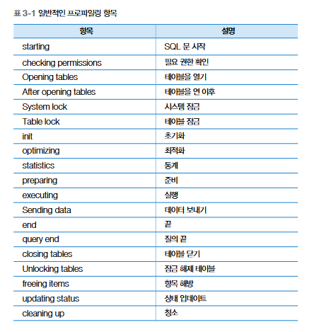
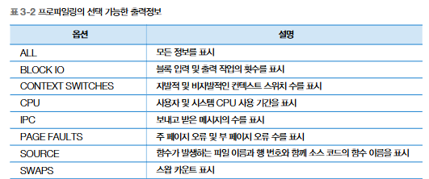

# 용어 정리
## 인덱스
- `고유 인덱스(unique index)` : 인덱스를 구성하는 열들의 데이터가 유일 
    - NULL 가능
- `비고유 인덱스(non-unique index)` : 고유 인덱스에서 데이터의 유일한 속성만 제외한 키 
    - 인덱스가 재정렬되더라도 인덱스 열의 중복 체크를 거치지 않고 단순한 정렬 작업을 수행 

## 서브쿼리 위치에 따른 SQL 용어
- SELECT절 : 스칼라 서브쿼리
- FROM 절 : 인라인 뷰
- WHERE 절 : 중첩 서브쿼리

## 메인쿼리와의 관계성에 따른 SQL 용어
- 비상관 서브쿼리 : 메인쿼리와 서브쿼리 간에 관계성이 없음을 의미
    - 서브쿼리가 독자적으로 실행된 뒤 메인쿼리에 그 결과를 던져줌
- 상관 서브쿼리 : 메인 쿼리 -> 서브 쿼리 -> 메인 쿼리

---

## 조인 

#### 드라이빙 테이블, 드리븐 테이블
- 드라이빙 테이블 : 적은 결과
- 드리븐 테이블 

### 1. 중첩 루프 조인 (NL join; Nested Loop Join) 
드라이빙 테이블의 데이터 한 건당 드라이브 테이블을 반복하여 조회하여 조인을 수행하는 방식입니다. 
#### 동작 방식
1. 드라이빙(Driving) 테이블에서 한 행을 가져옵니다.
2. 드리븐(Driven) 테이블에서 해당 행과 매칭되는 데이터를 찾습니다. 

#### 예제
```sql
SELECT *
FROM 학생 A
JOIN 비상연락망 B
ON A.학번 = B.학번;
```

#### 장단점
- 장점 : 인덱스가 있을 경우 작은 데이터셋에서는 효과적입니다.
- 단점 : 두 테이블 모두 인덱스가 없을 경우 O(N * M)의 복잡도를 가집니다. 


#### 1) 블록 중첩 루프 조인 (BNL join; block nested loop join)
드라이빙 테이블에 조인 버퍼를 도입하여, 여러 개의 행을 한꺼번에 비교하여 드리븐 테이블의 전체 검색 횟수를 줄이는 방식입니다.  

1. 드라이빙 테이블(학생) 테이블에서 학번 1, 100 데이터 검색
2. 검색된 데이터를 조인 버퍼에 적재
3. 조인 버퍼 ↔️ 드리븐 테이블(비상연락망) 간 데이터 비교

#### 2) 배치 키 엑세스 조인 (BKA join; Batched Key Access Join)
중첩 루프 조인 방식에서 랜덤 액세스의 단점을 해결하기 위해 접근할 데이터를 미리 예상하고 가져오는 활동입니다.  

##### 다중 범위 읽기 (MRR; multi range read)
드리븐 테이블에 필요한 데이터를 미리 예측하고 정렬된 상태로 버퍼에 적재하는 기능입니다. 
드리븐 테이블에 대해 시퀀셜 엑세스를 하게 됩니다.  

1. 드라이빙 테이블에서 필요한 데이터를 추출하여 조인 버퍼에 저장합니다. (학번1, 100 데이터)
2. 드리븐 테이블의 인덱스를 기반으로 필요한 데이터를 예측하여 랜덤 버퍼에 저장합니다. (학번1, 100데이터)
3. 학생.학번 = 비상연락망.학번 조인 조건절로 조인 버퍼 <=> 랜덤 버퍼를 비교합니다. 
4. 동일한 데이터가 있다면, 드리븐 테이블의 데이터에 접근하고 결과를 조인해 반환합니다.  


### 2. 해시 조인 (Hash Join)
한 테이블을 해시 테이블로 변환한 후, 다른 테이블의 데이터를 해시값으로 비교하여 조인을 수행하는 방식입니다.

#### 동작 방식 
1. 작은 테이블(드라이빙 테이블)을 해시 테이블로 변환 (해시 키를 생성하고, 해당 키를 기준으로 데이터를 해시 버킷에 저장)
2. 큰 테이블(드리븐 테이블)의 데이터를 하나씩 읽어와 동일한 해시 함수를 적용
3. 생성된 해시 값이 해시 테이블의 키와 일치하는 경우, 조인 수행

#### 예제
학생 테이블과 비상연락망 테이블을 학번 기준으로 해시 테이블을 만든 후 비교
학번 1 -> 해시 값 - 동일한 해시값을 비상 연락망 테이블에서 검색

#### 장단점
- 장점 : 인덱스 없어도 조인이 가능, 대용량 데이터에 효과적
- 단점 : 해시 테이블을 만들기 위한 메모리가 필요, 작은 테이블이 메모리에 올라가야 최적의 성능 발휘

##### 1) Grace Hash Join: 작은 테이블이 메모리에 안 올라갈 때 디스크를 활용
##### 2) Hybrid Hash Join: 일부 데이터를 메모리에 올리고 나머지는 디스크에 저장

### 3. 소트 머지 조인 (Sort Merge Join)
두 개의 조인 테이블을 각각 정렬한 다음 정렬된 데이터를 비교하여 조인합니다.  

#### 동작 방식
1. 조인할 두 테이블을 조인 키를 기준으로 정렬합니다.
2. 정렬된 두 테이블을 앞에서부터 하나씩 비교하여 매칭되는 데이터를 찾습니다.
3. 매칭된 데이터는 조인 결과로 반환됩니다.

#### 예제
```sql
SELECT *
FROM 학생 A
JOIN 비상연락망 B
ON A.학번 = B.학번;
```
학번 컬럼을 기준으로 정렬
정렬된 데이터를 앞에서부터 비교하여 매칭

#### 장단점
- 장점: 정렬된 데이터에서는 매우 빠름, 랜덤 액세스 없이 순차적으로 비교하므로 대량의 데이터에 효과적
- 단점: 정렬 비용이 큼, 이미 정렬된 데이터가 아니라면 비효율적

---

# 오브젝트 스캔 유형
## 테이블 스캔 (table scan)
인덱스를 거치지 않고 바로 `디스크에 위치한 테이블 데이터에 접근`하는 유형

> 테이블 풀 스캔

## 인덱스 스캔 (index scan)
`인덱스로` 테이블 데이터를 찾아가는 유형

> 인덱스 범위 스캔, 인덱스 풀 스캔, 인덱스 고유 스캔, 인덱스 루스 스캔, 인덱스 병합 스캔

## 1. 테이블 풀 스캔 (table full scan)
인덱스를 거치지 않고 테이블의 처음부터 끝까지 데이터를 훑어보는 방식  
WHERE 절의 조건문을 기준으로 활용할 인덱스가 없거나, 전체 데이터 대비 대량의 데이터가 필요할 때 수행  

## 2. 인덱스 범위 스캔 (index range scan)
인덱스를 `범위 기준으로 스캔`한 뒤 스캔 결과를 토대로 테이블의 데이터를 찾아가는 방식  
SQL문에서 BETWEEN ~ AND 구문이나 <, >, LIKE 구문 등 비교 연산 및 구문에 포함될 경우 수행  
좁은 범위를 스캔할 때는 성능적으로 효율적이나 넓은 범위를 스캔할 때는 비효율적  

## 3. 인덱스 풀 스캔 (index full scan)
인덱스를 `처음부터 끝`까지 수행하는 방식   
테이블에 접근하지 않고 인덱스로 구성된 열 정보만 요구하는 SQL 문에서 인덱스 풀 스캔이 수행됨  
인덱스는 테이블보다 상대적으로 적은 양을 차지하므로 테이블 풀 스캔 방식보다는 인덱스 풀 스캔 방식이 성능상 유리함   
하지만, 검색 범위를 줄이는 방향으로 SQL 튜닝을 해야 함  

## 4. 인덱스 고유 스캔 (index unique scan) 
`기본 키나 고유 인덱스`로 테이블에 접근하는 방식  
인덱스를 사용하는 스캔 방식 중 가장 효율적인 스캔 방법  
WHERE절에 = 조건으로 작성하며, 해당 조인 열이 기본 키 또는 고유 인덱스의 선두 열로 설정되었을 때 활용  

## 5. 인덱스 루스 스캔 (index loose scan)
`인덱스의 필요한 부분`들만 골라 스캔하는 방식  
WHERE 절 조건문 기준으로 필요한 데이터와 필요하지 않은 데이터를 구분한 뒤 불필요한 인덱스 키는 무시함  
GROUP BY 구문, MAX(), MIN() 함수가 포함되면 작동  
오름차순으로 정렬된 인덱스에서 최댓값이나 최솟값이 필요한 경우  

## 6. 인덱스 병합 스캔 (index merge scan)
테이블 내에 생성된 `인덱스들을 통합`해서 스캔하는 방식  
WHERE 문 조건절의 열들이 서로 다른 인덱스로 존재하면 옵티마이저가 해당하는 인덱스를 가져와서 모두 활용하는 방식  
통합하는 방법으로는 Union과 Intersection 방식이 있으며 이는 실행 계획에서 확인 가능  
`물리적으로 존재하는 개별 인덱스를 각각 수행하므로 인덱스에 접근하는 시간이 몇 배로 걸림`
별개로 생성된 인덱스들은 보통 하나의 인덱스로 통합하여 SQL 튜닝을 수행하거나, SQL 문 자체를 독립된 하나의 인덱스만 수행하도록 변경할 수 있음  

---

# 디스크 접근 방식 
> 데이터가 저장된 storage의 page에 접근
- 페이지? 
    - 데이터를 검색하는 최소 단위
    - 페이지 단위로 데이터 읽고 쓰기를 수행할 수 있음 

- 시퀀셜 액세스?
    - 서로 연결된 페이지를 차례대로 읽기 

- 랜덤 액세스?
    - 여기 저기 원하는 페이지를 임의로 열어보며 데이터 읽기  

## 시퀀셜 액세스 
`물리적으로 인접`한 페이지를 차례대로 읽는 순차 접근 방식  
테이블 풀 스캔에서 활용됨
데이터를 찾고자 이동하는 `디스크 헤더의 움직임을 최소화`하여 작업 시간과 리소스 점유 비용을 줄일 수 있음  
`테이블 풀 스캔`일 때는 인접한 페이지를 여러 개 읽는 `다중 페이지 읽기(multi page read)`방식으로 수행함  


## 랜덤 액세스
`물리적으로 떨어진 페이지들`에 임의로 접근하는 임의 접근 방식  
페이지가 위치한 물리적인 위치를 고려하지 않고 접근함  
페이지에 접근하는 디스크 헤더가 `정해진 순서 없이 이동`하는 만큼 `디스크의 물리적인 움직임`이 필요하고 `다중 페이지 읽기가 불가능`하기 때문에, 데이터의 접근 수행 시간이 오래 걸림  
최소한 페이지에 접근할 수 있도록 접근 범위를 줄이고 효율적인 인덱스를 활용할 수 있도록 튜닝해야 함  



---

# 조건
- `엑세스 조건` : 맨 처음 디스크에서 데이터를 검색하는 조건  
- `필터 조건` : 디스크에서 가져온 데이터에서 추가로 추출하거나 가공 및 연산하는 조건 
    - 스토리지 엔진에서 MySQL 엔진으로 데이터를 전달하는 오버헤드가 있음
    - 필터 조건으로 제거되는 데이터 비율을 확인하고 특정 SQL문의 튜닝이 필요한지 판단  

---

# 선택도와 카디널리티 
## 선택도 
테이블의 특정 열을 기준으로 해당 열의 조건절에 따라 선택되는 데이터 비율  
해당 열에 `중복되는 데이터가 많다`면 `선택도가 높다`고 평가, 조건절에 따라 `대량의 데이터`가 선택됨  
해당 열에 중복되는 데이터가 적다면 선택도가 낮다고 평가, 조건절에 따라 매우 적은 양의 데이터가 선택됨  

낮은 선택도가 오히려 대용량 데이터에서 원하는 데이터만 골라내는 능력  
낮은 선택도를 가지는 열 : 데이터를 조회하는 SQL문에서 원하는 데이터를 빨리 찾기 위한 인덱스 열을 생성할 때 주요 고려대상이 됨 

데이터에 접근하고자 특정 열에 대한 조건문을 작성하고 해당 조건문에 포함되는 열의 선택도를 산출  
- `선택도` = `선택한 데이터 건수` % `전체 데이터 건수`

선택되는 조건절의 데이터 건수를 매번 계산할 수 없고, 데이터의 삭제와 수정, 삽입이 수시로 발생하므로 중복이 제거된 데이터의 건수를 활용하여 선택도를 일반화홤  
- `변형된 선택도` = `1` % `DISTINCT(COUNT 열명)`

## 카디널리티 (Cardinality)
하나의 데이터 유형으로 정의되는 데이터 행의 개수  
전체 데이터에 접근한 뒤 출력될 것이라 예상되는 데이터 건수  
현업에서는 전체 행에 대한 특정 열의 중복 수치를 나타내는 지표로 자주 활용됨  

- `카디널리티 = 전체 데이터 건수 x 선택도`

특정 열에 중복된 값이 많다면 카디널리티가 낮고 해당 열을 조회하면 상당수의 데이터를 거르지 못한 채 대량의 데이터가 출력될 것임  

# 힌트 
데이터베이스에게 힌트를 전달함으로써 데이터를 빠르게 찾을 수 있도록 함  

STRAIGHT_JOIN : FROM 절에 작성된 테이블 순으로 조인을 유도하는 힌트 
USE INDEX : 특정 인덱스를 사용하도록 유도하는 힌트 
FORCE INDEX : 특정 인덱스를 사용하도록 강하게 유도하는 힌트
IGNORE INDEX : 특정 인덱스를 사용하지 못하도록 유도하는 힌트  

# 콜레이션 (collation)
특정 문자셋으로 데이터베이스에 저장된 값을 비교하거나 정렬하는 작업의 규칙  

# 통계 정보
## 히스토그램
테이블의 열 값이 어떻게 분포되어 있는지 확인하는 통계 정보  
옵티마이저가 실행 계획을 최적화하고자 참고하는 정보  
잘못된 히스토그램 정보가 있다면 잘못된 실행 계획으로 SQL문이 수행될 수 있음  
특정 열 값들의 통계정보가 히스토그램으로 수집되지 않았다면, 중복이 제거된 열값의 개수 (COUNT(DISTINCT 열명))로 대략적인 열값의 분포를 예측하고 실행 계획을 수립함  

MySQL에서 내부적으로 열의 분포를 저장할 때는 높이균형 히스토그램(height balanced histogram)방식을 사용함  
저장된 데이터값의 종류가 수백, 수천, 수만 개 이상이므로 이 데이터 값들을 그룹화하고 정해진 bucket 만큼 분리해서 열의 통계정보 데이터를 저장함  

---
# 실행 계획 수행
- 명령어 : EXPLAIN, DESCRIBE, DESC 

## id  : 실행 순서를 표시하는 숫자  
SQL문이 수행되는 차례를 ID로 표기한 것 
조인할 때는 똑같은 ID가 표시됨. ID의 숫자가 작을수록 먼저 수행된 것이고 ID가 같은 값이라면 두 개 테이블의 도인이 이루어진 것임  

## select_type : SQL문을 구성하는 SELECT 문의 유형 
- `SIMPLE` : `UNION이나 내부 쿼리가 없는` SELECT문  
- `PRIMARY` : 서브쿼리가 포함된 SQL문이 있을 때 `첫번째 SELECT문`에 해당하는 구문에 표시되는 유형, 서브쿼리를 감싸는 외부 쿼리거나 UNION 이 포함된 SQL문에서 첫번째로 SELECT 키워드가 작성된 구문에 표시됨  
- `SUBQUERY` : 독립적으로 수행되는 서브쿼리 
- `DERIVED` : FROM 절에 작성된 서브쿼리
- `UNION` : UNION 및 UNION ALL 구문으로 합쳐진 SELECT문에서 첫번째 SELECT 구문을 제외한 이후의 SELECT 구문에 해당하는 걸 나타냄 
- `UNION RESULT` : UNION ALL 이 아닌 UNION 구문으로 SELECT 절을 결합했을 때 출력됨. 
    - UNION은 출력 결과에 중복이 없는 유일한 속성을 가지므로 각 SELECT 절에서 데이터를 가져와 정렬하여 중복 체크하는 과정을 거침 
    - 따라서, UNION RESULT는 별도의 메모리 또는 디스크에 임시 테이블을 만들어 중복을 제거하겠다는 의미임 

UNION 구문으로 결합되기 전의 각 SELECT문이 중복되지 않는 결과가 보장될 때는 UNION 구문보다는 UNION ALL 구문으로 변경하는 SQL 튜닝을 수행함  

- `DEPENDENT SUBQUERY` : UNION 또는 UNION ALL을 사용하는 서브쿼리가 메인 테이블의 영향을 받는 경우, UNION으로 연결된 단위 쿼리들 중에서 처음으로 작성한 단위 쿼리에 해당되는 경우  
    - UNION으로 연결되는 첫번째 단위 쿼리가 독립적으로 수행하지 못하고 메인 테이블로부터 값을 하나씩 공급받는 구조이므로 성능상 불리하여 SQL문 튜닝을 수행함 
- `DEPENDENT UNION` : UNION 또는 UNION ALL을 사용하는 서브쿼리가 메인 테이블의 영향을 받는 경우, UNION으로 연결된 단위 쿼리 중 첫번째 단위 쿼리를 제외하고 두번째 단위 쿼리에 해당하는 경우  
    - UNION으로 연결되는 두번째 이후의 단위 쿼리가 독립적으로 수행하지 못하고 메인 테이블로부터 값을 하나씩 공급받는 국조 이므로 성능적으로 분리하여 SQL 튜닝을 수행함 
- `UNCACHEABLE SUBQUERY` : 메모리에 상주하여 재활용되어야할 서브쿼리가 재사용되지 못할 때 출력되는 유형 
    - 해당 서브쿼리 안에 사용자 정의함수나 사용자 변수가 포함되거나 RAND(), UUID() 함수등을 이용하여 매번 조회 시마다 결과가 달라지는 경우 

- `MATERIALIZED` : IN 절 구문에 연결된 서브쿼리가 임시 테이블을 생성한 뒤, 조인이나 가공 작업을 수행할 때 출력되는 유형  
    - IN 절의 서브쿼리를 임시 테이블로 만들어서 조인 작업을 수행하는 것  
    - IN 절 구문의 서브쿼리를 임시테이블로 만들어서 조인 작업을 수행  

## table : 테이블 명 
서브쿼리나 임시테이블은 <subquery#> <derived#>로 출력됨 

## partitions
실행 계획의 부가 정보로 데이터가 저장된 논리적인 영역을 표시하는 항목  
사전에 정의한 전체 파티션 중 특정 파티션에 선택적으로 접근한느 것이 SQL 성능 측면에서 유리함  
너무 많은 영역의 파티션에 접근하는 것으로 출력된다면 파티션 정의를 튜닝해봐야함  

## type 
테이블의 데이터를 어떻게 찾을지에 관한 정보를 제공하는 항목  
테이블을 처음부터 끝까지 전부 확인할지 아니면 인덱스를 통해 바로 데이터를 찾아갈지 등을 해석할 수 있음  

- system : 테이블에 데이터가 없가나 한 개만 있는 경우 
- const : 조회되는 데이터가 단 1건일 때 출력되는 유형 
- eq_ref : 조인이 수행될 때 드리븐 테이블의 데이터에 접근하며 고유 인덱스 또는 기본 키로 단 1건의 데이터를 조회하는 방식  
    - 드라이빙 테이블과의 조인 키가 드리븐 테이블에 유일하므로 조인이 수행될 때 성능상 가장 유리  
- ref : 조인을 수행할 때 드리븐 테이블의 데이터 접근 범위가 2개 이상일 경우, 드라이빙 테이블과 드리븐 테이블이 조인을 수행하면 일대다 관계가 되므로, 드라이빙 테이블의 1개 값이 드리븐 테이블에서는 2개 이상의 데이터로 존재함  
    - 기본키나 고유 인덱스를 활용하면 2개 이상의 데이터가 검색되거나 유일성이 없는 비고유 인덱스를 사용하게 됨  
    - 드리븐 테이블의 데이터양이 많지 않을 때는 성능 저하를 크게 우려하지 않아도 되지만, 데이터양이 많다면 접근해야 할 데이터 범위가 넓어져 성능 저하의 원인이 되는지 확인해야 함  
    - 비교연사자를 사용해 인덱스로 생성된 열을 비교할 때도 출력됨  
- ref_or_null : ref 유형과 유사하지만 IS NULL 구문에 대해 인덱스를 활용하도록 최적화된 방식, NULL 은 가장 앞쪽에 정렬됨. 
    - 테이블에서 검색할 NULL 데이터 양이 적다면 ref_of_null 방식을 활용했을 때 효율적인 SQL문이지만, 검색할 NULL 데이터양이 많다면 SQL 튜닝의 대상 
- range : 테이블 내의 연속된 데이터 범위를 조회하는 유형 
    - 주어진 데이터 범위 내에서 행 단위로 스캔하지만, 스캔할 범위가 넓으면 성능 저하의 요인이될 수 있으므로 SQL 튜닝 검토 대상 
- fulltext : 텍스트 검색을 빠르게 처리하기 위해 전문 인덱스(full text index)를 사용하여 데이터에 접근하는 방식  
- index_merge : 인덱스들이 동시에 사용되는 유형, 특정 테이블에 생성된 두 개 이상의 인덱스가 병합되어 동시에 적용됨  
- index : 인덱스 풀 스캔, 물리적인 인덱스 블록을 처음부터 끝까지 훑는 방식, 데이터를 스캔하는 대상이 인덱스라는 점이 다르고 ALL 유형과 유사함 
    - 테이블 풀 스캔 방식보다는 빠름
- all : 테이블을 처음부터 끝까지 읽는 테이블 풀 스캔 방식 
    - 활용할 수 있는 인덱스가 없거나 비활용하는 게 효율적이라고 판단했을 때 
    - 전체 테이블의 10% - 20% 이상 분량의 데이터를 조회할 때는 ALL 유형이 오히려 성능상 유리할 수 있음

## possible_keys
옵티마이저가 SQL문을 최적화하고자 사용할 수 있는 인덱스 목록 출력  

## key 
옵티마이저가 SQL 문을 최적화하고자 사용한 기본키 또는 인덱스명  
비효율적인 인덱스를 사용했거나 인덱스 자체를 사용하지 않았다면 SQL 튜닝의 대상  

## key_len 
사용한 인덱스의 바이트 수 

## ref 
테이블 조인을 수행할 때 어떤 조건으로 해당 테이블에 액세스되었는지를 알려주는 정보  

## rows 
SQL 문을 수행하고자 접근하는 데이터의 모든 행 수를 나타내는 예측 항목  
디스크에서 데이터 파일을 읽고 메모리에서 처리해야 할 행 수를 예상하는 값, 수시로 변동되는 MySQL의 통계정보를 참고하여 산출하는 값이므로 수치가 정확하진 않음  
최종 출력될 행 수가 아님  

## filtered
SQL 문을 통해 DB 엔진으로 가져온 데이터 대상으로 필터 조건에 따라 어느 정도의 비율로 데이터를 제거했는지를 의미하는 항목  
DB엔진으로 100건의 데이터를 가져왔다고 가정, WHERE 절의 사원번호 between 1 and 10 조건으로 100건의 데이터가 10건으로 필터링 됨  
100건에서 10건으로 필터링 되었으므로 filtered 에는 10이라는 정보가 출력될 것임  

## extra 
- distinct : 중복이 제거되어 유일한 값을 찾을 때 출력되는 정보  
- using where : 실행 계획에서 자주 볼 수 있는 extra 정보  
- using temporary : 데이터의 중간 결과를 저장하고자 임시 테이블을 생성하겠다는 의미
    - 데이터를 가져와 저장한 뒤에 정렬 작업을 수행하거나 중복을 제거하는 작업 수행
    - distinct, group by, order by 구문이 포함된 경우 using temporary 정보가 출력됨  
    - SQL 튜닝의 대상  
- using index : 물리적인 데이터 파일을 읽지 않고 인덱스만을 읽어서 SQL 문의 요청사항을 처리할 수 있는 경우 (covering index)
    - 인덱스로 구성된 열만 SQL문에서 사용할 경우 이 방식을 활용함  
    - 물리적으로 테이블보다 인덱스가 작고 정렬되어 있으므로 적은 양의 데이터에 접근할 때 성능 측면에서 효율적임  
- using filesort : 정렬이 필요한 데이터를 메모리에 올리고 정렬  작업을 수행한다는 의미 
    - 보통 이미 정렬된 인덱스를 사용하면 추가적인 정렬 작업이 필요 없지만, 인덱스를 사용
- using join buffer : 조인을 수행하기 위해 중간 데이터 결과를 저장하는 조인 버퍼 사용 
    - 드라이빙 테이블으리 데이터에 먼저 접근한 결과를 조인 버퍼에 담고 난 뒤, 조인 버퍼와 드리븐 테이블 간에 서로 일치하는 조인 키 값을 찾는 과정을 수행 
    - 조인 버퍼를 활용하는 일련의 과정이 존재하면 Using Join Buffer 정보가 출력됨 
- using union / using intersect / using sort_union 
    - 인덱스가 병합되어 실행되는 SQL의 extra 항목에는 인덱스를 어떻게 병합했는지에 관한 상세 정보가 출력됨  
    - using union : 인덱스들을 합집합처럼 모두 결합하여 데이터에 접근, SQL문이 OR 구문으로 작성된 경우 
    - using intersect : 인덱스들을 교집합처럼 추출하는 방식, SQL문이 AND 구문으로 작성된 경우에 확인할 수 있는 extra 정보
    - using sort_union : using union과 유사하지만, WHERE절의 OR구문이 동등조건이 아닐 때 확인할 수 있는 extra 정보  
- using index condition 
    - 필터 조건을 스토리지 엔진으로 전달하여 필터링 작업에 대한 mysql 엔진의 부하를 줄이는 방식 
    - 스토리지 엔진의 데이터 결과를 mysql 엔진으로 전송하는 데이터양을 줄여 성능 효율을 높일 수 있는 옵티마이저의 최적화 방식  
- using index condition(bka)
    - 데이터를 검색하기 위해 배치 키 액세스 사용 
- using index for group-by
    - group by 구문이나 distinct 구문이 포함될 때는 인덱스로 정렬 작업을 수행하여 최적화함 
    - using index for group-by는 인덱스로 정렬 작업을 수행하는 인덱스 루스 스캔일 때 출력되는 부가 정보
- not exists 
    - 하나의 일치하는 행을 찾으면 추가로 행을 더 검색하지 않아도 될 때 출력되는 유형  
    - 왼쪽 외부 조인 또는 오른쪽 외부 조인에서 테이블에 존재하지 않는 데이터를 명시적으로 검색할 때 발생  

# 좋고 나쁨을 판단하는 기준 
- select_type : SIMPLE, PRIMARY, DERIVED <=> DEPENDENT *, UNCACHEABLE *
- type : system, const, eq_Ref <=> index, all
- extra : using index <=> using filesort, using temporary


# 프로파일링 
느린 쿼리나 문제가 있다고 의심되는 SQL문의 원인을 확인할 수 있음  
```sql
show variables like 'profiling%';
set profiling = 'ON';
```

그리고, 프로파일링을 수행할 SQL문을 출력해본다  

```sql
show profiles;
```

```sql
show profile for query #;
```

특정 status에 해당되는 duration 값이 높게 나타난다면 문제가 될 소지가 높은 구간이다  





```sql
show profile all for query 1;
```