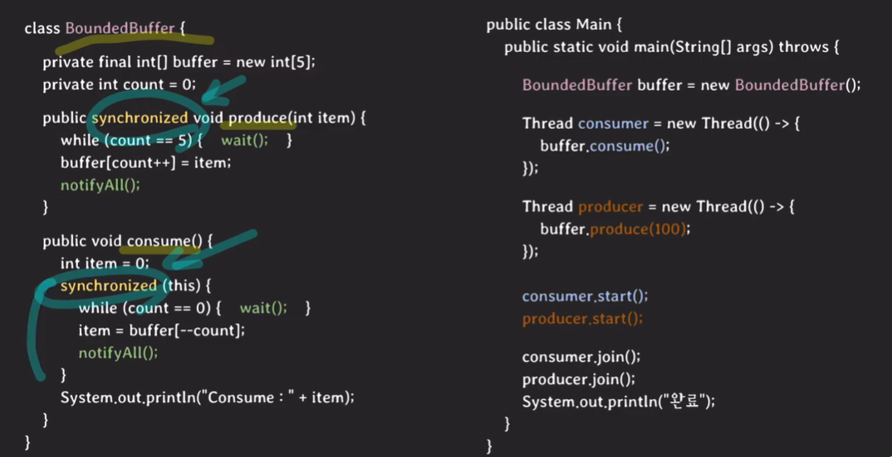

# 동기화 도구 
## 스핀락(spinlock)
```c
volatile int lock = 0;
void critical() {
    while(test_and_set(&lock) == 1); // 여기서 lock 값에 따라 스레드가 여기 잡혀있게 되어 있음
    ... critical section
    lock = 0;
}

int test_and_set(int* lockPtr) { // atomic 연산
    int oldLock = *lockPtr;
    *lockPtr = 1;
    return oldLock;
}
```

- test_and_set은 CPU atomic 명령어
    - 실행 중간에 간섭받거나 중단되지 않는다 
    - 같은 메모리 영역에 동시에 실행되지 않는다 

> 멀티 코어 환경이고 critical section에서의 작업이 컨텍스트 스위칭보다 더 빨리 끝난다면 스핀락이 뮤텍스보다 더 이점이 있다 


## 뮤텍스(mutex)
- 한 번에 하나의 스레드만 접근할 수 있도록 하는 `상호 배제(Mutual Exclusion)` 기법 
- 락을 걸고 풀 수 있는 `권한이 같은 스레드`에 있음
- priority inheritance 속성을 가진다 (critical section에 진입한 작업(a)보다 더 높은 우선순위를 가지는 작업(b)의 요청이 들어오면 a의 우선순위를 b만큼 높임으로써 우선순위를 통한 스케줄링에서 우위를 점할 수 있도록 한다)
- 상호 배제만 필요한 경우 사용
- `Lock / UnLock`

```c
#include <stdio.h>
#include <pthread.h>

pthread_mutex_t mutex;

void* thread_function(void* arg) {
    pthread_mutex_lock(&mutex);
    printf("Thread %d in critical section\n", *(int*)arg);
    pthread_mutex_unlock(&mutex);
    return NULL;
}

int main() {
    pthread_t t1, t2;
    int id1 = 1, id2 = 2;

    pthread_mutex_init(&mutex, NULL);
    pthread_create(&t1, NULL, thread_function, &id1);
    pthread_create(&t2, NULL, thread_function, &id2);

    pthread_join(t1, NULL);
    pthread_join(t2, NULL);
    pthread_mutex_destroy(&mutex);

    return 0;
}
```

## 세마포어(semaphore)
> signal mechanism을 가진 하나 이상의 프로세스/스레드가 critical section에 접근 가능하도록 하는 장치 

- `공유 자원의 개수를 제한`할 수 있는 동기화 기법
- 여러 개의 스레드가 접근 가능하며, 카운터를 통해 제어
- 작업 간의 실행 순서 동기화가 필요하다면 사용하자 
- `P(Wait) / V(Signal)`

```c
#include <stdio.h>
#include <pthread.h>
#include <semaphore.h>

sem_t semaphore;

void* thread_function(void* arg) {
    sem_wait(&semaphore);
    printf("Thread %d in critical section\n", *(int*)arg);
    sem_post(&semaphore);
    return NULL;
}

int main() {
    pthread_t t1, t2;
    int id1 = 1, id2 = 2;

    sem_init(&semaphore, 0, 2);  // 최대 2개의 스레드가 동시에 접근 가능
    pthread_create(&t1, NULL, thread_function, &id1);
    pthread_create(&t2, NULL, thread_function, &id2);

    pthread_join(t1, NULL);
    pthread_join(t2, NULL);
    sem_destroy(&semaphore);

    return 0;
}
```

## 모니터
> 공유 자원에 대한 접근을 안전하게 제어하는 고수준의 추상화된 동기화 도구

### 모니터 구성요소
- 뮤텍스 (Mutex) 
    - critical section에서 mutual exclusion을 보장하는 장치
    - critical section에 진입하려면 mutex lock을 취득해야 함
        - mutex lock을 취득하지 못한 스레드는 큐에 들어간 후 대기(waiting) 상태로 전환
        - mutex lock을 쥔 스레드가 lock을 반환하면 락을 기다리며 큐에 대기상태로 있던 스레드 중 하나가 실행 
- 조건 변수(Condition Variable) 
    - waiting queue를 가짐 : 조건이 충족되길 기다리는 스레드들이 대기 상태로 머무는 곳
    - wait : thread가 자기 자신을 condiiton variable의 waiting queue에 넣고 대기 상태로 전환 
    - signal : waiting queue에서 대기 중인 스레드 중 하나를 깨움
    - broadcast : waiting queue에서 대기 중인 스레드 전부를 깨움 

https://www.youtube.com/watch?v=Dms1oBmRAlo


### 자바 모니터
- 모든 객체가 내부적으로 monitor를 지닌다
- synchronized 키워드로 사용한다 
- condition variable을 하나만 가진다 
1) wait  
2) notify  
3) notifyAll  

