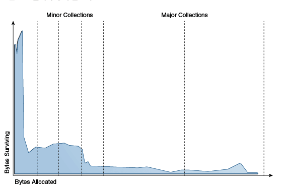

# GC root : native 영역에 있고 reachable한 객체를 찾기 위한 출발점 
- thread stack (지역 변수) 
- thread 객체 : active thread 객체에서 참조하는 객체들 - ThreadLocal, Runnable 객체
- ClassLoader (정적 변수) : 클래스로더들이 로딩한 클래스들이 참조하는 객체들, 대표적으로 정적 변수 
- JNI 참조 : 네이티브 코드에서 참조하고 있는 객체들
- Monitor : 동기화에서 사용 중인 모니터 객체들 

# Generational Collection (serial GC 기준)
> 객체 생존 패턴에 맞춰 GC 전략을 다르게 가져가자

## 1. 왜 Generational로 나누는가?

- 전제1. 대부분 객체는 태어나서 금방 죽고, 오래된 객체는 계속 살아남을 가능성이 크다 

  - yong, old 영역을 관리하자, aging

## 2. 그래서 GC 전략도 다르게 가져간다 

- 더 오래된 객체에서 더 젊은 객체를 참조하는 경우는 거의 없다 
    - remembered set : minor GC에서 GC root 역할

- 영역을 다음과 같이 구성한다 
    - `[young generation = eden + survivor0 + survivor1 + ...][old generation]`

### Young Generation
#### 특징
- 객체 대부분 곧 죽음
- 살아남는 애 적음
👉 Mark-Copy

#### 왜 Copy가 좋냐?
대부분 죽음 → 복사할 객체 적음
단편화 없음
allocation 빠름

### Old Generation
- 살아있는 객체 많음
- 크기도 큼
👉 Mark-Sweep + Compact

##### 왜 Copy 안 쓰냐?
살아있는 객체 많음 → 복사 비용 폭발
메모리 2배 필요 → 비효율

- 기본: Mark-Sweep
- 단편화 심해지면: Compact

## 참고 
- free 공간 확보 방법

| 방식                 | 객체 이동 | 단편화  | 메모리 사용 | 성능 특징         |
| ------------------ | ----- | ---- | ------ | ------------- |
| Mark-Sweep  (힙 크기와 전체 객체 수에 비례)       | ❌ 없음  | ❌ 발생 | 효율적    | 단편화 문제        |
| Mark-Sweep-Compact | ✅ 있음  | ✅ 없음 | 효율적    | 이동 비용 큼       |
| Mark-Copy    (live 객체 수에 비례;비어있는 공간 필요)   | ✅ 있음  | ✅ 없음 | 2배 필요  | 빠른 allocation |

### Serial GC
Serial GC는 단일 스레드로 동작하는 가장 단순한 GC로, GC 수행 시 애플리케이션을 완전히 중단시키는 Stop-The-World 방식이다.
Young 영역에서는 Mark-Copy를 사용해 빠르게 Minor GC를 수행하고, Old 영역에서는 Mark-Sweep-Compact를 사용해 메모리를 정리한다.
구현이 단순하고 작은 Heap에서는 효율적이지만, 멀티코어를 활용하지 못하고 pause time이 길어져 서버 환경에서는 잘 사용되지 않는다.

객체는 Eden에 생성되고, Eden이 가득 차면 Minor GC가 발생한다.  
Minor GC에서는 GC Root와 remembered set을 기준으로 살아있는 객체만 탐색하여 Survivor 영역으로 복사하고, 이 과정에서 age가 증가한다.  
일정 age에 도달한 객체는 Old 영역으로 promotion되며, Young 영역은 복사를 통해 전체가 초기화된다.  
이후 Old 영역이 가득 차면 Major GC가 발생하며, 이때는 Mark-Sweep-Compact 방식으로 메모리를 정리한다.  

> Serial GC는 Generational 구조에서 Young은 Copy, Old는 Mark-Sweep-Compact를 사용하며, 모든 과정이 Single Thread STW로 수행된다.

# Caffeine Cache
Caffeine Cache는 JVM Heap 위에서 동작하는 로컬 캐시이기 때문에 GC와 밀접한 관련이 있습니다. 캐시에 저장된 객체는 대부분 오래 살아남아 Old 영역으로 승격되기 때문에, 캐시 크기가 커지면 Major GC 빈도와 pause 시간이 증가할 수 있습니다. 따라서 maximumSize나 expire 정책을 통해 메모리 사용을 제한하고, GC 부담을 고려한 설계가 필요합니다.

- Java에서 사용하는 고성능 in-memory 로컬 캐시 라이브러리 
- 멀티스레드 환경에서 성능 좋음
    - Lock-free 구조 (CAS 기반)
    - ConcurrentHashMap 기반
- eviction 정책
    - W-TinyLFU 알고리즘 사용 
- 캐시에 넣는 순간 전부 JVM 객체 
    - 캐시에 계속 쌓이면 Old 영역 채움 -> Major GC 빈도 증가 
    - 메모리 사용량 증가(String Reference)
    - GC pause 시간 증가 

## 케이스 1 : 캐시 size 없음 + 트래픽 증가 
👉 Old 꽉 참 → Full GC 폭발

## 케이스 2 : 캐시 hit율 낮음 
👉 쓸모없는 객체만 쌓임 → GC만 힘들어짐

## 케이스 3 : 객체 크기 큼
👉 promotion 바로 발생 → Old 압박 심함

성능과 일관성을 모두 확보하기 위해 Caffeine과 Redis를 함께 사용하는 2단 캐시 구조를 사용할 수 있습니다. 먼저 Caffeine에서 조회하여 빠른 응답을 제공하고, 캐시 미스 시 Redis를 조회하며, Redis에도 없을 경우 DB를 조회합니다. 데이터 변경 시에는 Redis Pub/Sub을 활용해 각 서버의 로컬 캐시를 무효화하거나, TTL 기반으로 일관성을 유지합니다.